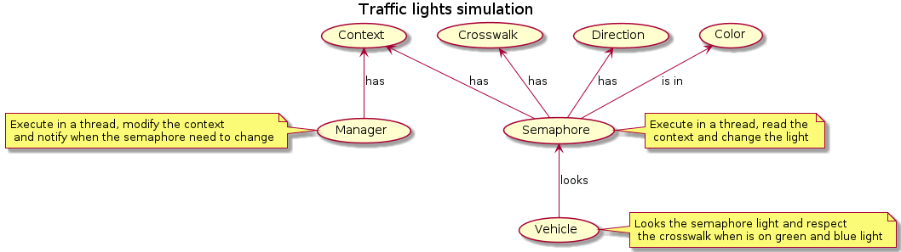
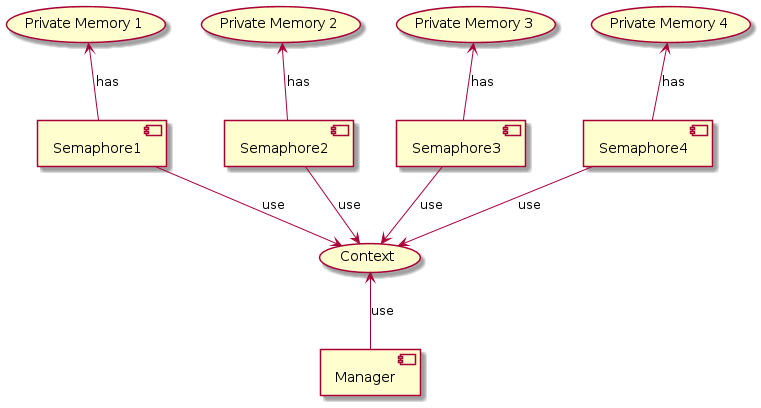

# Practice #1 - Threading

## Document Purpose

This document has as purpose to define in big scale all project decision and component.

### Goals

- Define the technology stack 
- Define the solution overview 
- Document the reason of the technology selection 

## Audience

- Professor and monitors: to evaluate and get feedbacks from them.
- Peers students: to share knowledge and ideas.

## Solution Overview

The solution is a traffic light simulation using thread. The main idea behind this is to sync the semaphores, so only one have the green light and the carts avoid collisions.

### Domain 

### Thread sync

For the thread synchronization process, we use conditional variable to notify when the thread is available, and the other thread can process with the execution also we follow the architecture of shared memory model to sync the thread information.

References 

- Conditional variable: https://docs.python.org/3/library/threading.html#threading.Conditio
- Shared Memory Model: https://hpc-tutorials.llnl.gov/posix/designing_threaded_programs/#shared-memory-model

## Scope 
- [*] You have the freedom to place the traffic lights at the points where the desired flow is resolved.
- [*] You have a budget to purchase a maximum of four traffic lights.
- [*] You must check that there are no collisions in the traffic flow.
- [*] You must animate your simulator with black arrows or car figures, giving the sensation of a real flow based on the traffic lights (red, green, yellow).
- [*] You must control the speed of the simulation with three options for the user:
     - Fast Simulation.
     - Intermediate Simulation
     - Slow Simulation.
- [*] The speed of each option must be parameterizable, and the user can adjust the seconds they want for each option (fast, intermediate or slow).
- [*] Consider enabling an option to reset the speed to default values.
- [*] The visual design of your program is free, but it must respond to the flow shown in the previous diagram.

## Technology Stack

Here is technology stack benchmark and selection.

<table>
  <thead>
    <tr>
      <th>Decision</th>
      <th>Alts</th>
      <th>Pros</th>
      <th>Cons</th>
    </tr>
  </thead>
  <tbody>
    <tr>
      <td>Programming language: Python</td>
      <td>
        <ul>
          <li>Java</li>
          <li>C#</li>
          <li>Javascript</li>
        </ul>
      </td>
      <td>
        <ul>
          <li>Developer knowledge</li>
          <li>Native thread support</li>
          <li>Simplicity</li>
        </ul>
      </td>
      <td>
        <ul>
          <li>Only have open sources game engine and are more complex</li>
        </ul>
      </td>
    </tr>
    <tr>
      <td>Game engine: Pygame</td>
      <td>
        <ul>
          <li>Unity</li>
          <li>Cocos2d</li>
        </ul>
      </td>
      <td>
        <ul>
          <li>Better performance</li>
          <li>Simplicity</li>
          <li>Pythonic (is pure python tool)</li>
          <li>Big community</li>
        </ul>
      </td>
      <td>
        <ul>
          <li>No GUI</li>
          <li>Have to handle all in code</li>
        </ul>
      </td>
    </tr> 
    <tr>
      <td>Level design toolkit: LDtk</td>
      <td>
        <ul>
          <li>Tiled</li>
        </ul>
      </td>
      <td>
        <ul>
          <li>Simplicity</li>
          <li>Big community</li>
          <li>Open source</li>
        </ul>
      </td>
      <td>
        <ul>
          <li>Unstable tools, still on beta</li>
        </ul>
      </td>
    </tr>
  </tbody>
</table>
  